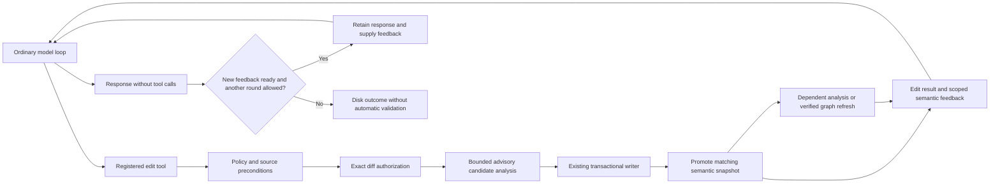

# Direct editing with incremental semantic feedback

**Status:** Complete — all implementation work, production cutover, cleanup, migration, documentation, performance validation, runtime acceptance checks, and reviews are complete; no work or validation remains outstanding

**Delivery track:** Maintenance

**Prerequisites:** Ordinary conversation/tool execution, transactional mutations, the persistent Roslyn engine and refresh coordinator, and existing approval/recovery infrastructure.

## 1 Objective

Let the model read, edit, inspect semantic feedback, and correct its work through one conversation. Remove mandatory model-generated implementation plans, host-selected steps, tranches, and a separate model request to translate each selected step into mutations. The model chooses edit order. An edit operation may contain related changes chosen by the model, but there is no host-imposed batching schedule.

Preserve semantic checks before and after edits, exact source preconditions, write authorization, recoverable transactions, cancellation, and honest completion reporting. Ordinary source edits must reuse the current Roslyn solution and return useful feedback without waiting for a full build/test cycle or rebuilding the entire model context.

Immediate Roslyn feedback is advisory information for the implementing model: catch likely syntax, name-resolution, missing-using, missing-reference and related compiler problems before an eventual full build/test run. Some findings may already be known to the model. The model may act on a finding immediately, complete related edits first, or continue with an explanation. These checks do not create another approval gate, require a repair loop after every edit, or establish that the final build/tests will pass. Full build and test results remain authoritative for the validation they actually perform.

This document is the completed implementation contract for replacing the mandatory planning workflow. Delivery includes production cutover, removal of obsolete code/configuration/prompts, migration, and documentation. The direct-edit path passes the solution build and regression suite. Clean-context source/artifact reviews and an implementation-contract alignment review found no remaining actionable findings in their assessed paths. Representative edit-latency measurements and runtime acceptance validation are complete. All ordered tasks and acceptance criteria are satisfied.

## 2 Architectural Context

Reuse the central pipeline from [ADR-11](../architecture/adr-11-central-tool-policy-pipeline.md), the transactional guarantees from [ADR-13](../architecture/adr-13-typed-transactional-mutations.md), and the Roslyn ownership/cancellation rules from [ADR-4](../architecture/adr-04-roslyn-msbuild-semantic-truth.md). Preserve the source-anchor improvements from [ADR-58](../architecture/adr-58-current-mutation-baselines-and-text-anchors.md).

The mandatory approved-plan execution protocol in [ADR-32](../architecture/adr-32-host-owned-resumable-execution-orchestration.md), the proposal-only file lifecycle contract in [ADR-36](../architecture/adr-36-structured-file-lifecycle-mutations.md), and the run-boundary semantic publication policy require explicit architectural amendments before production migration. Direct tool invocation can still materialize host-owned mutation DTOs and use the same transaction path. It does not require direct ungoverned filesystem writes.

Keep completed implementation plans as historical contracts. Update current architecture and operational contracts when the replacement is implemented; do not present this proposal as current behavior.

## 3 Scope

- One ordinary model/tool loop for reading, source editing, semantic feedback, and correction.
- Persistent, versioned Roslyn snapshots with incremental document changes and scoped diagnostics.
- Reuse of exact-diff approval, conflict detection, commit, rollback, and durable effect reconciliation.
- A reproducible performance experiment on a representative real solution, including the failed workload's supporting-file access pattern.
- Removal of the competing mandatory plan/step/proposal workflow after the replacement passes its exit criteria.

## 4 Non Scope

This analysis does not authorize deployment, a paid live-model run, changes to the user's other repository, or removal of the existing editing workflow before the replacement works. It does not add a second workspace engine, background job service, diagnostic database, tool scheduler, or frontend-specific edit path. Final build and test validation remains available and retains its own meaning.

## 5 Current State

This section records the pre-implementation state and findings that motivated the completed work; references to the previous workflow describe that historical baseline.

### The failed workload and the rollback

The October 5 raw model log reached approved step 2 after completing step 1. Four implementation responses each requested two reads. The implementation loop rejected the second read before executing either; the advertised reader encouraged independent read batching. All three correction attempts were consumed. Step 2's mutation baseline contained only its three target files, while requested supporting files were outside it. The new evidence filter would have rejected those supporting reads even if the call-count rejection were fixed.

The implementation-specific read loop, automatic refresh, baseline-membership filter, dedicated continuation reserve, associated prompts, and feature-only tests were rolled back. Retained changes cover dependency provenance, session/path-indexed supersession, timestamp-aware mutation/rollback invalidation, and their tests. The previous mutation workflow remains available. The withdrawn design is recorded in [the source-evidence work item](maintenance-current-implementation-source-evidence.md).

### Actual owners and call paths

| Area | Existing implementation | Consequence for the replacement |
| --- | --- | --- |
| Model/tool continuation | `SessionApplication.ConversationLoop.cs`: `InvokePendingToolBatchAsync`, correlated results, evidence admission, request preparation and continuation capacity | Extend this execution path; do not create another implementation model loop. |
| Tool legality and execution | `ToolInvocationPipeline.cs`; `ToolBatchScheduler.cs` and `ToolConflictPlanner` | Preserve identity-fenced registration, policy, activity, cancellation, and model ordering. Configure edit calls as serial/conflicting initially. |
| Tool visibility | `ConversationToolAvailability.CreateSnapshot` / `IsAdvertised` | Conversation availability alone is insufficient: policy-required-approval tools can be filtered out. Approval discovery and execution must be reconciled deliberately. |
| Current mutation generation | `MutationProposalApplication.HandleCoreAsync`, scope checks, normalization, overlay construction | Reuse exact-anchor normalization and overlay materialization; retire the separate model request and mandatory approved-step scope for the new mode. |
| Transactional effects | `TransactionalWorkspace.StageAsync`, `CommitAsync`, conflict checks, compensation, rollback; coordinator registration and promotion | Keep one writer. The internal `MutationSet` is a transaction representation, not a model planning requirement. |
| Durable effects | `ExecutionOrchestrator.ApplyCoreAsync` writes `ExecutionOperationRecord` intent and recovery checkpoints around commit | A direct call to `CommitAsync` alone does not preserve durable recovery. Separate this reusable effect ownership from plan-step progression. |
| Semantic ownership | `SemanticEngineRegistry`; `SemanticEngine.RefreshDocumentsAsync`; `SemanticCompilationCoordinator` | Reuse one engine per bound workspace, its preparation scheduling and cancellation ownership. |
| Current precheck | `MutationProposalApplication.AnalyzePreMutationAsync` sets `IncludeCompilation = false` and rejects diagnostic errors | Current proposal checking is syntax-oriented. Simply removing plans does not enable early semantic feedback. |
| Existing semantic analysis | `SemanticEngine.AnalyzePreMutationAsync` creates an overlay, requests affected-project preparation and compares baseline/candidate diagnostics | Useful primitives exist, but this is not yet a bounded edit-feedback API with promotable candidate results. |
| Current semantic diagnostics | `SemanticEngine.GetDiagnosticsAsync` prepares requested projects, refreshes their document paths from disk, then obtains compilation diagnostics | Passing one changed file does not make this a changed-file-only operation. Do not call it blindly after every edit. |
| Final validation | `ValidationPipeline.ValidateAsync` selects build-backed diagnostics or semantic-only diagnostics; tests and acceptance follow | Retain for explicit/final validation. Separate interactive semantic feedback from final acceptance. |

Source references: [conversation loop](../../src/Threadsmith.Execution/SessionApplication.ConversationLoop.cs), [proposal application](../../src/Threadsmith.Execution/MutationProposalApplication.cs), [orchestrator](../../src/Threadsmith.Execution/ExecutionOrchestrator.cs), [tool pipeline](../../src/Threadsmith.Tools/ToolInvocationPipeline.cs), [tool scheduler](../../src/Threadsmith.Tools/ToolBatchScheduler.cs), [tool visibility](../../src/Threadsmith.Tools/ConversationToolAvailability.cs), [transactional workspace](../../src/Threadsmith.Workspaces/TransactionalWorkspace.cs), [semantic engine](../../src/Threadsmith.DotNet/SemanticEngine.cs), [semantic preparation](../../src/Threadsmith.DotNet/SemanticEngine.Preparation.cs), [validation pipeline](../../src/Threadsmith.Validation/ValidationPipeline.cs).

### Concrete integration and cost constraints

1. **Refresh publication currently waits for run completion.** `SessionApplication.PublishAsync`, implementing `ISemanticRefreshPublicationGate`, awaits all active runs for the workspace. `SemanticRefreshCoordinator` uses this gate for incremental and full publication. An edit tool awaiting that publication inside its own run would wait on its own completion. Replace the run-lifetime publication barrier with safe operation boundaries; do not bypass the existing owner with another engine.
2. **Document refresh already avoids eager downstream compilation, but replaces its preparation coordinator.** `RefreshDocumentsCoreAsync` updates existing documents with `WithDocumentText`, aborts and joins previous preparation, creates replacement preparation, and increments the generation. Measure that transition cost and avoid repeatedly abandoning unrelated useful work.
3. **Creation, deletion, and graph changes need additional work.** The public incremental refresh requires existing loaded C# documents. The coordinator classifies unknown/deleted C# documents and graph-control/additional/analyzer-config inputs as full refresh. The proposed workflow must not promise cheap file creation merely because Roslyn supports document additions.
4. **Precheck work includes complete project diagnostics.** The overlay path evaluates candidate compilation diagnostics and baseline compilation diagnostics. Cache baseline results by semantic input identity, and share candidate analysis with the committed snapshot instead of recomputing identical work.
5. **Some transaction operations scale with the captured baseline.** Promotion rereads changed files but copies/sorts the retained snapshot map. `VerifyBaselineAsync` enumerates repository inputs and hashes baseline paths. It is a validation-reuse guard, not an appropriate unconditional per-edit check. Use exact touched-file preconditions for editing and versioned validation coverage for acceptance.
6. **Model context and Roslyn context are separate costs.** A compiler generation change should produce bounded new evidence, not an unconditional transcript/context rebuild. Preserve provider replay history; add results through the established continuation path.

These are source-based findings, not measurements attributing the reported 60-second delay to one function.

## 6 Proposed Design

### One execution path

The [current conversation-flow diagram](../operations/conversation-loop.md) details the visible late-feedback notification, including the round-limit case. Graph replacement retains feedback delivery while verified replacement analysis is pending. Model-facing error totals are omitted for pending, obsolete or unavailable coverage; user-visible summaries use plain text rather than serialized analysis.

Implement a host-owned edit tool in `Threadsmith.Execution`, where tool implementations such as `ActiveTurnEvidenceTool` already exist. Register it through composition and invoke it through the ordinary pipeline. This keeps `Threadsmith.Tools` from depending on execution or Roslyn implementations. Manual entry points should dispatch to the same edit application command; internal semantic edits must materialize into that same transaction path.

The model supplies file operations and source anchors. The host supplies effect identity, workspace identity, current file versions, policy, and approval identity. User-requested plans can remain advisory; an edit does not require an `ImplementationPlan`, `StepId`, batch ordinal, or a second model generation pass.

### Three independent identities

- **Write preconditions:** hashes/absence checks for the actual edited endpoints; authorization covers the exact candidate diff. A later user edit causes a conflict, not silent rebasing under old approval.
- **Semantic snapshot:** versioned project graph, parse/compilation options, references and document contents. Compiler objects remain internal and ephemeral.
- **Evidence freshness:** observed source digest/range plus invalidation. A supporting file can be read without belonging to the write set. Reading never expands write authority.

Do not encode all three as one mutation baseline. Retain bounded host DTOs across subsystem boundaries.

### Before and after semantics

Start from snapshot N. Construct a candidate from the proposed text changes, including all linked-document owners. Perform syntax and bounded semantic analysis against this candidate, comparing with known baseline diagnostics at N. Authorization and source preconditions remain hard gates. Compiler diagnostics, including syntax errors, become advisory feedback: a signature edit may precede caller repairs. Malformed tool arguments remain rejected, but valid edit instructions that produce temporarily invalid C# are not the same failure. This changes the existing reject-on-diagnostic-error policy and must be explicit.

After the transaction verifies the committed bytes, promote the identical candidate to N+1 through the semantic owner. Reuse candidate analysis when source bytes, project inputs and reference identities still match. If they do not, mark the analysis obsolete and refresh affected inputs. A semantic publication failure after a successful disk commit must report `applied` with unavailable/pending analysis, never imply that the write did not happen.

Maintain diagnostics relative to the previous snapshot for useful per-edit deltas, and preserve the known initial diagnostic basis for final acceptance. An error introduced by edit 1 must not become an ignored baseline error at edit 2. When initial coverage was unavailable, report unknown origin rather than claiming a diagnostic is new or pre-existing.

Precheck and postcheck remain distinct assurances, but need not duplicate compilation: the precheck evaluates a candidate; the postcheck establishes that the committed snapshot is that candidate and expands affected coverage.

### Bounded feedback and publication

First return changed-document syntax and semantic results that fit the experiment's latency allowance. Continue owning-project and dependent-project analysis through the existing compilation scheduler. Never label incomplete coverage as clean. Method-body edits can affect other documents and inferred/public semantics, so document-only results are explicitly partial, with broader coverage scheduled conservatively.

Prototype a shared immediate-analysis budget, testing 100, 250, 500 and 1,000 milliseconds, before choosing a product setting. These are experimental values, not promised response times. A cold project is a separate case; do not force full readiness before permitting an otherwise authorized edit.

Use immutable snapshot/version receipts and the existing refresh owner's dirty/applied generations to replace the run-terminal barrier. Publish at a tool boundary without holding a workspace lock during provider I/O. Queries retain their admitted immutable snapshot; results for superseded inputs are discarded or clearly historical. Extend existing host-write attribution so filesystem watcher events do not schedule a duplicate reload for the same edit. External changes still invalidate independently.

The edit tool returns a compact receipt: applied/conflict/denied status, changed paths, workspace version, semantic coverage, new/resolved/current error counts, a bounded diagnostic list, and pending analysis status. Compiler errors do not turn a successful write into a failed tool operation.

Later diagnostics enter the existing conversation as fresh bounded host evidence at a provider-compatible boundary, before the next request when ready. Do not rewrite sealed tool results. Prefer new actionable diagnostics and resolved findings over repeated complete error lists. Delivery must also work when the next action is a final answer, without inventing an extra mandatory semantic-completion gate. The model decides when to invoke full build/test validation, with guidance to resolve incremental compiler findings first; response completion does not trigger it automatically. Matching authoritative build results supersede pending advisory analysis of older snapshots. Avoid a model polling loop. Keep a bounded latest-result mailbox owned by the existing run/workspace coordination, rather than another durable diagnostic service.

### Ordering and lifecycle changes

Initially serialize write calls per workspace through the existing scheduler and transactional owner, preserving the model's call order. Independent reads can retain existing concurrency; reads overlapping writes must respect their conflict claims. Tool transport grouping is not an implementation tranche. A model may choose one multi-file operation, but should not have to describe future operations in advance.

Prototype source create/delete/move only where evaluated project membership is known, including linked files and multiple target frameworks. For ambiguous includes, project/reference/option changes, and generator inputs, schedule a visible graph refresh with partial/unavailable semantic status. Do not treat a generated file as an ordinary source document or guess MSBuild inclusion rules. Preserve existing analyzer/source-generator trust and isolation rules.

## 7 Public Contracts

Introduce the smallest host-owned edit command/receipt and semantic candidate receipt needed by the two owners. Reuse existing mutation and diagnostic DTOs where they express the behavior. Candidate receipts should be opaque outside the compiler subsystem; do not persist Roslyn objects.

The edit receipt must distinguish disk outcome from analysis outcome. The diagnostic receipt needs source generation, project/target-framework coverage, completion state, omissions and diagnostic identity. Diagnostic matching must avoid reporting every line shift as a new error; first reuse the existing classifier/fingerprint policy and test its limits.

### Model-facing contract and phase instructions

Remove phase instructions as a model execution protocol. There is no mandatory evidence-collection, change-planning, implementation-proposal, or correction phase. Keep operational host states where needed for cancellation, approvals, effects, validation and recovery; they do not select a different model workflow. A user can ask for a written plan as an ordinary response without creating an approved executable plan object.

Replace `ContextAssembler.GetPhasePromptFileName`, phase-dependent required-output selection, and plan-dependent evidence eligibility with a stable conversation instruction set and capability/policy-based admission. Retain relevance, provenance, trust, freshness and capacity checks. Do not rebuild the provider prefix when a tool changes operational state. Review phase-based cache keys and workload routing: preserve actual capacity/provider distinctions without manufacturing a planning/proposal cache family.

Suggested system wording, to refine alongside actual tool schemas:

> Choose the implementation sequence appropriate to the user's task. Inspect relevant source, make edits, and use tool results to guide further work. Edit results may include incremental Roslyn diagnostics intended to catch likely syntax, missing using directives, unresolved names, missing references, and related compiler problems before a full build or test run. This feedback is advisory and may be partial, pending, or already known. Address valid findings before expensive validation when practical; you may complete related edits first. Use a full build and appropriate tests to validate the completed work, and report checks that were not run.

The edit tool description must state that an operation applies authorized edits immediately, may contain related changes across files, uses exact source preconditions, and returns separate write and semantic outcomes. It must not request a plan ID, tranche, batch ordinal or future schedule. Preserve legitimate payload/resource ceilings; do not replace soft batch targets with a new host-selected edit grouping algorithm.

Semantic result guidance must distinguish `partial`, `pending`, `complete for listed coverage`, and `unavailable`; identify the analyzed snapshot; and say that diagnostics do not undo or reject a committed edit. Build/test descriptions should recommend reviewing available relevant diagnostics before execution without introducing a semantic-clean prerequisite. Avoid repeating these paragraphs in every result: stable instructions explain intent; results carry changes, coverage and actionable findings.

Remove `System-Phase-*` assets after moving useful generic inspection, permission and validation guidance into the stable instructions or relevant tool descriptions. Remove `System-RequiredOutput-Plan.md`, `System-RequiredOutput-MutationProposal.md`, and `Context-IncrementalPlanning.md`. Retain generic provider/tool argument corrections. Replace blocking pre-mutation wording with advisory diagnostics; retain useful exact-anchor error explanations. Update the flat prompt filename/token catalog and both prompt inventories in the same implementation change. Test rendered requests for obsolete phase requirements, not just asset existence.

## 8 Project and File Changes

| Owner | Reuse or extend | Remove after migration |
| --- | --- | --- |
| Execution | Ordinary conversation continuation, tool registration, existing approval coordination, effect intent/recovery, result delivery | Mandatory `GeneratePlanAsync` → approved-step → `MutationProposalApplication` model cycle for direct editing; tranche continuation/replan scheduling |
| Workspaces | Exact-anchor normalization/materialization, bounded touched-file capture, previews, commit/compensation/rollback | Per-edit dependence on plan-wide baseline identity; unnecessary map rebuilding where measured |
| DotNet | Registry, snapshot overlays, document refresh, generation fencing, compilation coordinator, diagnostic classification inputs | Run-lifetime publication wait for edit-owned refresh; duplicate candidate/committed analysis |
| Context | Ordinary capacity/compaction, source provenance/invalidation, bounded diagnostic evidence | Plan/baseline/step framing in direct-edit requests; implementation-specific source eligibility |
| Tools/App | Central policy and scheduler; register the execution-owned edit tool and semantic services | Special implementation reader registration and a second tool-execution protocol |
| Validation/Interaction | Explicit/final build and tests; shared exact-diff approval and visible semantic progress | Step/batch UI requirements for direct edits; treating every compiler error as rejected application |

The rollback already removed the new special reader path. Future removal must include dead prompts, configuration, projections, tests and documentation; hiding old machinery behind a new tool name is not completion.

### Concrete deletion and extraction inventory

The entries below identify current owners, not permission to delete entire mixed-purpose files. At task A, enumerate references and record whether each symbol is removed, retained for a named live caller, or retained solely for bounded historical deserialization. Resolve every entry before completion.

| Current code or asset | Required disposition |
| --- | --- |
| `SessionApplication.cs`: `GeneratePlanAsync`, `propose_plan`, `complete_objective`, approved-plan and continuation dispatch | Remove mandatory planning and tranche completion protocol. Keep ordinary session lifetime, steering, model selection, accounting and conversation execution. Route ordinary final responses through shared completion handling. |
| `MutationProposalApplication.cs`, `PreparedMutationProposal.cs` | Extract exact-anchor normalization, operation-schema validation, preview and overlay materialization into the single edit application path; remove provider calls, plan-scope admission, `propose_mutations`, `request_replan`, proposal-only retries and syntax-error rejection. Delete emptied types/files. |
| `ExecutionOrchestrator.cs`, `ExecutionOrchestratorRouter.cs`, `RunStateMachine.cs` | Preserve effect intent/reconciliation, shared final validation and run lifetime; remove approved-step scheduling, tranche continuation, proposal generation and forced correction transitions. Delete routers/state branches with no remaining caller. Do not keep the old orchestrator reachable through a legacy setting. |
| `PlanSanityChecker.cs`, Core `PlanningContracts.cs`, `PlanApprovalContracts.cs` | Delete structured-plan admission, risk scoring and live plan approval contracts. Move genuinely shared path/operation validation to its existing owner before deleting. Isolate any required historical record reader from live commands. |
| Workspaces `PlanApprovalPolicyService.cs`, `RepositoryPlanApprovalPolicyStore.cs`, `PlanApprovalRepositoryBinding.cs`, `PlanApprovalPathSafety.cs` | Delete plan policy service/storage/binding; preserve or move path safety only if another live store needs it. Keep `MutationApprovalPolicyService` and repository trust. |
| `ApplicationComposition.cs`, `HostFoundation.cs`, `ConfigurationBootstrap.cs`, `InteractiveFrontendRunner.cs` | Remove plan service construction/injection, command registrations, plan options and defaults. Register one edit application/tool and wire existing semantic/transaction owners. |
| Interaction `InteractionCoordinator`, `InteractionController`, `InteractionShell`, `InteractiveCommandCatalog`; CLI `HeadlessShell` | Remove `/plan-policy`, policy selection/current/reset/revoke handlers, plan approvals, pending-plan resume UI and methods. Retain exact-diff approval, cancellation, activity, cumulative diff and truthful completion. Trace presenter/interfaces and concrete frontend renderers from these callers. |
| `ExecutionLimits.cs`: `MutationBatchingOptions`, `IncrementalPlanningOptions`, `Plan`, `MaxPlanSanityIssues`, `MaxPlanningToolRounds` | Delete obsolete limits and validators. Keep shared model rounds, malformed-call correction bounds, tool/output limits, source-frontier and delegation limits; rename misleading plan-oriented comments. Audit `MaxStructuredOutputCharacters` and replace only with an equivalent shared argument bound if still necessary. |
| Context phase policy, plan/step/baseline request projections, phase prompt selection and cache identity | Remove the model phase protocol as described in section 7. Keep generic source evidence, context fitting, provider replay and resource accounting. |
| Execution `Correction-Plan*`, plan-sanity issue assets, mutation replan/proposal/implementation-phase correction assets | Delete with callers and catalog entries. Retarget reusable diagnostic/anchor rendering. Review `Correction-PreMutation-BlockingDiagnostics.md` specifically so syntax/semantic errors are never presented as permission denial. |
| Core execution contracts, durable events/checkpoints, persistence serializers, in-memory/session projections | Remove live plan/step/tranche payloads and transitions. Preserve stable discriminators/numeric identities for old records or add explicit schema migration. Do not renumber an enum serialized in historical sessions. |

Search by references as well as filenames. Terms such as `ImplementationPlan`, `PlanId`, `StepId`, `AllowPlanContinuation`, `PlanApproval`, `MutationBatching`, `IncrementalPlanning`, `propose_plan`, `propose_mutations`, `request_replan`, `complete_objective`, and phase enum members form the cleanup checklist. Record intentional remaining references; zero unclassified matches is the exit criterion. Do not delete unrelated algorithms such as `ModelCachePlanner`, `CodeExploreSourceAllocationPlanner`, tool conflict planning, skill format names, or delegation scheduling merely because their names contain “plan”. Inspect `DelegateAgentsPlanning.cs` for parent-plan coupling while preserving explicit model-requested delegation.

### Tests to remove, relocate, or rewrite

| Existing tests | Disposition |
| --- | --- |
| `Threadsmith.Planning.Tests/Milestone4Tests.cs`, `PlanContentTests.cs` | Delete assertions whose sole purpose is plan schema, risk/approval, tranche sizing or phase admission. Move any shared path safety, prompt trust, source projection or conversation behavior to the owning suite. |
| Planning project `AnthropicConversationLoopTests`, `Plan80ActiveTurnContinuationTests`, `Plan113ActiveTurnSourceProjectionTests`, `ModelOutputCoalescerTests`, `ModelOutputCoalescingIntegrationTests` | Preserve ordinary provider continuation, projection and streaming coverage; rewrite setup to the direct conversation path. Historical test filenames are not evidence that behavior is obsolete. Rename/rehome as appropriate. |
| `ExecutionOrchestratorTests.Incremental.cs`, `.Replanning.cs`, plan-dependent portions of the base suite | Remove scheduling/tranche/replan assertions. Replace behavioral coverage for steering, multi-edit order, completion and interruption with real direct-loop tests. |
| Orchestration `.Baseline.cs`, `.Conversation.cs`, `.OutcomeRedaction.cs`, `.MemoryRecall.cs` | Preserve source conflicts, recovery, ordinary dialogue, redaction and memory behavior. Eliminate artificial plan construction from test setup. |
| Mutations `Milestone5Tests.Incremental.cs`, `.Preview.cs`, `Milestone5Tests.cs`, `ApprovalPolicyPersistenceTests.cs` | Delete proposal/batching-only behavior and plan policy cases. Preserve preview, exact approval, operation validation, transactional conflicts/rollback and mutation approval persistence under the shared edit command. |
| `BaselineFileSnapshotTests.cs`, `Milestone5Tests.SourceEvidence.cs` | Retain relevant snapshot integrity, provenance/indexing and rollback invalidation coverage; do not remove the retained review fixes. |
| Context, native tools, interaction/frontend, persistence, architecture and prompt packaging suites | Update fixtures/golden requests to the new contract. Add targeted migration and retired-command/asset absence checks. Keep approval, trust and dependency-direction coverage. |

Remove a test project, solution entry, helper, package or fixture only when all useful tests have been relocated and no consumer remains. Update CI/test scripts and coverage configuration if they reference renamed/deleted projects. Do not preserve a dead planning subsystem solely to keep its tests green, or delete mixed-purpose suites to avoid porting safety coverage.

## 9 Ordered Tasks

**Completion:** Tasks A–H are complete, including every task's exit criteria and the removal-ledger verification. The work packages below are retained as the implementation contract.

These are implementation work packages for agents, not runtime phases imposed on the model. Execute dependencies in order; keep intermediate changes buildable. Read the C# guardrails and current call sites before modifying code. Do not introduce a permanent feature flag or second production execution path.

### A. Establish ownership and removal ledger

Completed inventory: [direct-editing removal ledger](maintenance-direct-editing-removal-ledger.md). Actual callers, migration fixtures and replacement tests have been verified; all required dispositions are resolved.

Confirm the active checkout and preserve unrelated working changes. Trace the section 8 symbols through registration, policy, frontend, persistence and tests. Inventory all plan settings across defaults, binders, schemas, examples, environment/CLI configuration and persistence. Record consumers of reusable mutation materialization, journal and approval code. Inspect the withdrawn source-evidence work item so its read loop is not reintroduced. Amend the relevant architectural decisions with the target protocol and compatibility boundary before cutover.

**Exit:** concrete symbol/file disposition list, durable record compatibility decision, and one named owner each for editing, approval, effect recovery, semantic publication and final validation. No unexamined duplicate execution path.

### B. Separate reusable edit effects from plan progression

Extract the smallest edit application command and host receipt using existing mutation DTOs. Reuse operation materialization, source anchors, touched-endpoint capture, preview and transactional writer. Move durable intent/checkpoint/reconciliation around that shared command before exposing it to a tool. Define invocation retry identity so replay cannot commit the same effect twice. Keep authorization tied to exact bytes and recheck after approval delays. Reject invalid operations/conflicts/policy violations; do not reject well-formed edits for compiler errors.

**Exit:** create/replace/delete/move and supported semantic materialization reach one writer, with exact-diff approval, failure compensation and crash recovery tests. No model provider dependency in the edit application. Existing callers use the extracted owner while migration is in progress.

### C. Permit safe in-run semantic publication

Replace the run-completion wait at the existing publication gate with versioned operation-boundary admission. Keep provider I/O outside the publication lock. Extend host-write attribution and watcher reconciliation. Retain immutable snapshots for admitted queries, fence out stale results, and propagate cancellation with abandon-and-discard for noncooperative Roslyn work. Avoid joining unrelated background compilation on every document update. Use the existing bounded compilation coordinator; coalesce superseded work without an unbounded queue.

**Depends on:** A; integrates with B. **Exit:** an active run can edit and query generation N+1 without waiting for its own completion; two sessions and external edits cannot publish mismatched state. Cancellation and workspace disposal remain bounded.

### D. Implement advisory candidate and committed feedback

Add internal candidate receipts; map changed paths to all document/project/target-framework owners through maintained indexes. Reuse cached baseline diagnostics keyed by semantic inputs. Analyze syntax and available scoped semantics within a bounded allowance, commit independently of compiler findings, and promote/reuse the exact matching candidate. Continue owning/dependent project analysis with explicit coverage. Handle missing membership, generators and graph changes through the existing refresh owner. Keep baseline origin across comparable edits, discard obsolete findings, and retain delivery tracking during pending verified graph replacement. Bound diagnostic count/text and retained candidate/latest-result memory; dispose candidates on conflict, denial or supersession.

**Depends on:** B–C. **Exit:** unresolved symbol and syntax error edits apply successfully; feedback and subsequent resolution reach the correct generation without builds. Partial/unavailable analysis is honest. Candidate and committed analysis are not duplicated when inputs match.

### E. Wire the ordinary conversation/tool loop and stable instructions

Register the execution-owned edit tool through the central pipeline. Fix availability for approval-capable tools without advertising denied capabilities; exact-diff authorization must not cause a second redundant generic approval. Preserve tool order through the existing scheduler, including overlapping reads/writes and multi-file calls. Deliver immediate receipts as tool results and delayed diagnostics as bounded evidence at legal provider boundaries. Exercise capacity handling through `CreateRequestEnvelope`, including the original two-supporting-read pattern near the token limit. Apply section 7 prompt changes and remove plan-required output admission. Keep malformed-call corrections separate from advisory compiler findings.

**Depends on:** B–D. **Exit:** a scripted provider performs supporting reads → edit → feedback → repair → final answer in one ordinary loop, with no plan/proposal request and no hidden tool path. The same provider adapters, activity events, steering and cancellation work. Final response does not silently claim pending analysis or omitted tests passed.

### F. Complete user surfaces, validation and durable migration

Route manual/internal entry points to the same edit command. Preserve existing delegated-agent restrictions; remove accidental plan prerequisites in delegation without adding new child write authority. Keep explicitly invoked build/test validation and cumulative disk reporting independent of an approved plan; ordinary response completion starts no validation. Remove plan approval UI/commands/configuration following section 13. Migrate or explicitly refuse legacy execution resumption after reconciling durable effects; keep history viewable. Verify interactive and headless results agree.

**Depends on:** E. **Exit:** no user needs a plan or plan approval to edit; mutation authorization still applies. Old settings cannot change new edit authority, and reopening a checkpoint cannot duplicate a write.

### G. Remove superseded implementation and documentation

Switch the supported default to the ordinary edit path and remove the old orchestration, rather than shipping both modes. Complete each section 8 ledger entry. Delete unused prompts/catalog entries, registrations, DTO producers, limits, renderers, retry budgets and fixtures. Relocate reusable tests before deleting old suites. Apply section 16 documentation updates. Run cleanup searches with an explicit allowlist for historical documents and compatibility readers. Review code outside the diff for remaining entry points.

**Depends on:** F and passing vertical-slice/safety checks. **Exit:** one production execution path; no live mandatory planning settings, scheduling, model phases or proposal generation. Every retained legacy symbol has a documented reason and no live producer.

### H. Validate performance and production behavior

Run targeted suites as each package changes; at completion run the solution build and affected integration/architecture/prompt-packaging checks, then the full relevant regression suite. Run the section 10 performance experiment on a representative solution with a scripted provider. Tune the bounded allowance using measurements. If a warm-path target is missed, report the measured stage and resolve unnecessary scope-wide work before marking this item complete. A live provider experiment requires applicable user authorization; deterministic provider testing must still prove the execution path and request count.

**Depends on:** G. **Exit:** recorded functional, recovery, migration and performance evidence; adversarial review of actual entry points; clean documentation links and `git diff --check`. Update this document's status only when all acceptance criteria hold.

## 10 Testing

**Validation status:** Complete — functional, integration, architecture, prompt-packaging, regression, recovery, migration, frontend, and representative-solution performance validation are complete. The required runtime acceptance checks and adversarial reviews are complete. The procedures and targets below are retained as the validation contract.

Functional coverage should exercise real entry points and synchronize on observable versions/events rather than runner-speed deadlines:

- Read two supporting files outside the write set, edit a target, then read the committed contents in the same conversation.
- Introduce an unresolved symbol; verify the edit is applied and the next model request receives the diagnostic; repair it and observe resolution without a build.
- Rename a signature, then repair callers across projects. Allow temporary errors and preserve model-selected order.
- Compare final scoped diagnostics with an authoritative compiler/build result on the same frozen inputs, including pre-existing errors and target frameworks. Record unsupported generator/analyzer coverage explicitly.
- Commit while earlier analysis is pending; stale findings must not be attributed to the newer version. Exercise rapid edits without unbounded queues or starvation of useful feedback.
- Reject denied/stale edits; preserve user changes during conflict/rollback. Test cancellation before commit, during compensation, and after commit but before result delivery; recover without duplicate writes.
- Verify exact-diff approval in both TUI and headless paths, including approved subsets if supported; analyze only the actually committed subset.
- Verify provider-native multiple read calls, read/edit ordering, continuation replay and context-pressure behavior through real provider adapters.

For the performance experiment, record separate cold and warm distributions across repeated fixed edits, including p50/p95, CPU/allocation data where available, and project/file counts. Measure tool admission, touched-file capture, precheck, approval wait, commit, snapshot publication, postcheck, diagnostic delivery, context assembly and provider latency separately. Count workspace reloads, projects prepared, files read/hashed, diagnostic passes and discarded analyses. Approval wait and provider time are not Roslyn latency.

A proposed warm-path target is useful local semantic feedback within one second on the representative solution, with an explicit pending result when broader checks exceed the allowance. This is a target to test, not an established guarantee. Ordinary body edits should cause zero full workspace loads, zero build/test processes and zero mandatory plan/proposal model passes.

## 11 Security and Permissions

Retain trust, approved/prohibited roots, exact content approval, source conflicts, reparse-point checks and host-owned effect identity. Keep existing tool hooks, MCP policy and cancellation boundaries. Advertise only supported capabilities, with prompts matching actual multi-call behavior. A direct source-edit tool is not an expansion of the existing artifact-only `write_file` permission.

For initial scope, do not silently advertise the new write capability to delegated children. Existing child isolation/ownership remains authoritative; when enabled, child/manual/internal entry points must reach the same edit command and transaction semantics, not alternative writers.

## 12 Observability

Use existing tool activities and semantic check events for visible starts, progress, completion, cancellation and failure. Extend them with edit identity and semantic generation/coverage where needed. Distinguish applied-with-errors, applied-with-analysis-pending, conflict, denied, and not-applied. Include the cost counters from section 10 in structured diagnostics without raw source or prompt bodies.

## 13 Migration and Compatibility

Keep the legacy workflow operational during prototype work. Extract reusable effect authorization/recovery from plan progression only where the shared call sites require it; do not duplicate journal or approval ownership. No new production default changes as part of this analysis.

At cutover, prevent older checkpoints from being interpreted as direct-edit receipts. Define explicit legacy resume or a clear migration boundary. Preserve cumulative diffs and durable write outcomes while removing step/tranche scheduling. Restart reopens compiler state; it never restores persisted Roslyn objects or replays an already committed edit.

### Configuration removal

| Retired setting/surface | Migration behavior |
| --- | --- |
| `planning:approvalPolicy`; `/plan-policy`; plan-policy getters/setters/events | Remove live configuration binding, supported schema, writing and UI. Existing values confer no authority on the edit tool. Never translate `alwaysTrustRepo` or `autoApproveAllValid` into mutation approval. |
| `planning:incrementalPlans:enabled`, `targetSteps`, `targetFiles` | Remove defaults, binding, validation and documentation. There is no toggle that restores mandatory planning. |
| `execution:mutationBatching:targetMutations`, `targetFiles`, `targetMutationCharacters` | Remove soft grouping options. Keep actual transport, memory, transaction and argument safety bounds under their existing owners. |
| `execution:maxPlanningToolRounds`, `execution:maxPlanSanityIssues`, settings bound into `PlanResourceLimits` | Remove plan-only limits. Enumerate exact `PlanResourceLimits` keys from current binders during A; retain only independently needed shared capacity limits with appropriate names and compatibility handling. |
| `mutation:approvalPolicy`, repository trust, tool permissions and normal execution budgets | Preserve their meaning and persisted values. Removing plan approval must not silently broaden write authority. |

Use the existing configuration/persistence ownership for an idempotent migration. Remove only identified obsolete properties from writable host/repository configuration when migrating it; preserve unrelated keys, formatting where supported, files and permissions. For read-only/external configuration layers, ignore retired keys with a bounded deprecation diagnostic rather than failing startup or reactivating old behavior. Ensure configuration save/export no longer emits them. Inventory legacy plan-policy trust artifacts and remove only confirmed exclusively obsolete state; do not infer ownership from a filename or sweep a user configuration directory. Do not create a replacement persistent plan-policy store just to migrate it.

Test nested configuration representations and precedence across supported layers, invalid old policy values, mixed old/new options, read-only files, interrupted/repeated migration, and an unchanged mutation-approval setting. If existing configuration infrastructure cannot safely rewrite a format, keep a narrow read compatibility rule and document manual cleanup instead of destructive normalization.

### Historical sessions and in-flight effects

The target has no legacy plan execution mode. Reconcile committed/pending mutation effects using the existing durable identities before closing an old plan checkpoint. Do not auto-approve, execute remaining steps, or replay committed edits. Preserve readable history and cumulative diff; explain that continuing the objective starts an ordinary conversation from current source. Retain only the minimal historical deserialization/migration layer necessary for supported stored versions, with fixtures proving the boundary. Keep old enum/discriminator values reserved where required. Document unsupported old versions explicitly rather than treating unreadable state as a new empty run.

## 14 Acceptance Criteria

**Acceptance status:** All criteria below are satisfied; no acceptance work remains outstanding.

- One model conversation performs read → edit → semantic feedback → repair, with no mandatory plan-generation phase or second mutation-generation loop.
- Prechecks and postchecks are version-correct, incremental where supported, and explicit about missing coverage. Errors remain actionable across edits.
- Semantic feedback is offered during implementation so it can reduce avoidable build/test failures. The model can sequence related edits without an enforced per-edit repair cycle; unavailable/pending feedback does not independently block editing. Model instructions require repairing introduced errors within the requested scope before finishing or explaining a conflict with the request. Ordinary completion does not wait for pending analysis or enforce a compiler-clean gate.
- Source edits reuse the workspace; supporting reads are independent of write scope; edits follow model order.
- Approval, conflicts, cancellation, durable recovery and shared frontend behavior remain verified through real entry points.
- The representative solution has recorded latency distributions and reload/analysis counters. A small synthetic fixture alone cannot establish success.
- Retired execution paths are deleted after replacement validation, rather than left as a competing protocol beneath the tool interface.
- Plan approval commands, settings, persistent writers and plan-only resource options are removed; legacy values cannot grant edit authority. Supported old histories remain readable and effect recovery cannot repeat a committed write.
- Model requests contain stable workflow guidance and advisory semantic intent, without mandatory phase-specific output or a host-selected implementation schedule. Syntax/semantic errors consume no malformed-call correction budget.
- The cleanup ledger has no unclassified live references; retained safety tests run through the shared path, unused test/project assets are removed, and current documentation describes the implemented workflow.

## 15 Risks

Warm Roslyn reuse can still be expensive on wide dependency graphs. Existing coordinator retirement, full-project diagnostic APIs, source generators and graph reevaluation can dominate latency. Background analysis can become perpetually obsolete under rapid edits; coalesce redundant work but preserve observable pending coverage and a final catch-up boundary. Approval changes and partial commits invalidate candidate reuse unless the receipt matches the actual applied content. Provider replay constrains when delayed feedback may be appended. Existing final-validation and recovery code carries plan assumptions that require focused separation.

The original analysis collected no host-stage timing of the failed real workload and performed no replacement prototype or live model run. That historical limitation does not describe the completed replacement validation; representative performance and runtime acceptance validation are complete. The original reported 60-second delay remains unattributed.

## 16 Documentation

**Documentation status:** Complete — all required current-contract, operational, prompt, configuration, acceptance, manual-procedure, and navigation updates are complete. Historical completed contracts remain preserved under planning governance.

At implementation, update the affected current ADRs, mutation/context/semantic contracts, tool and prompt catalogs, both prompt inventories, resource-limit documentation, user-facing approval/completion guidance, acceptance scenarios and manual procedures. Honor [planning governance](planning-governance.md); keep historical completed plans frozen. Changes to prompt roles, schema and authority remain code-owned.

| Documentation owner | Required change |
| --- | --- |
| ADR-7, ADR-13, ADR-32, ADR-36, ADR-56, ADR-58; ADR-4/11/43 where behavior changes | Record replacement of mandatory plan/proposal execution, advisory diagnostics, state/publication boundary, preserved transactions and approval, and model-order tool execution. Use explicit supersession/amendment links; do not leave contradictory active contracts. |
| `docs/architecture/mutation-model.md`, `semantic-mutations.md`, `context-policy.md`, `semantic-confidence.md` | Remove approved-step/baseline membership as model authority; describe source preconditions, candidate/committed identities, coverage and freshness. Preserve genuine trust and semantic operation constraints. |
| `docs/operations/tools.md`, `parallel-tools.md`, `semantic-refresh.md`, `execution-resumption.md`, `resource-limits.md` | Describe direct edit use, ordering, incremental/pending diagnostics, graph refresh, recovery migration, and surviving limits. Remove tranche sizing, plan policy and implementation-only read advice. |
| `docs/operations/prompts.md`, `docs/prompt-file-reference.md`, prompt assets/catalog/package tests | Remove deleted filenames/tokens and document stable instructions/tool guidance. Verify published payloads match the catalog with no dead phase assets. |
| Configuration references/examples, README/help, frontend command documentation | Remove `/plan-policy`, plan approval choices and retired keys. Explain exact-diff approval and preserve mutation approval settings. Search current docs for every retired key and tool name. |
| `acceptance-scenarios.md`, `manual-test-plan.md` | Replace live mandatory plan/tranche workflows with direct editing, advisory errors/repair, policy/conflicts, pending coverage and recovery. Retain stable MTP IDs; mark obsolete procedures Retired and link replacement cases. Identify exact scenario/MTP IDs during A rather than inventing IDs here. |
| Active maintenance plans for mid-tranche replanning, mutation preview, source evidence and semantic reconciliation | Inspect current status and reconcile overlapping active work to this contract. Keep retained capabilities and mark superseded scope explicitly; do not require implementation of a withdrawn competing path. |
| Completed implementation plans and milestone details | Preserve historical contracts under governance. Do not globally replace historical “plan” or “phase” terminology. Current navigation should lead to the new workflow without restating status. |

Documentation cleanup is part of G, not optional follow-up. Check links, published prompt assets, examples and executable manual instructions. Run the governance searches and `git diff --check` after edits. A documented historical reference is an allowed cleanup-search match; obsolete instructions in active user guidance are not.

## 17 Open Decisions

**Decision status:** All implementation decisions below are resolved and validated; no open decision blocks completion. The questions are retained to record the original decision scope.

- Which observed latency allowance yields useful immediate semantics on the representative solution? Measure before selecting the permanent default.
- Which lifecycle/project shapes can safely update evaluated document membership incrementally, and which require graph reevaluation?
- Which minimal existing approval coordinator extension exposes exact-diff review without a redundant generic approval prompt? Resolve in B/E; retaining plan approval is not an option.
- Explicit validation workflows retain their configured stages and acceptance rules; ordinary response completion does not invoke them. Missing, failed or omitted checks cannot establish build/test success, and advisory Roslyn feedback is not authoritative validation.

The user has already selected the direction: eliminate mandatory plans/tranches and preserve incremental semantic pre/post feedback. These questions concern implementation details and evidence, not whether to retain the old model scheduling protocol.
