# Conversation and execution loop

This diagram shows the ordinary Threadsmith conversation loop and the governed implementation path. The host owns phase selection, capability admission, approvals, persistence, mutation application, validation, correction limits, and completion. Model output is accepted only through the formatter and the tools advertised for the current phase.

```mermaid
flowchart TD
    USER["User request or explicit resume"] --> CONTEXT["Assemble bounded model context"]
    HISTORY[("Sanitized conversation archive<br/>and current-run receipt")] -. "recent context" .-> CONTEXT
    MEMORY[("Repository memories")] -. "selected standing and relevant<br/>situational memories" .-> CONTEXT
    INSTRUCTIONS["Host, user, and repository instructions"] -. "ordered context" .-> CONTEXT

    CONTEXT --> BEFORE_MODEL["BeforeModelRequest hook boundary"]
    BEFORE_MODEL --> MODEL["Model request<br/>phase tools plus output formatter"]
    MODEL --> AFTER_MODEL["AfterModelRequest hook boundary"]
    AFTER_MODEL --> RESPONSE{"Formatted model response"}

    RESPONSE -- "ordinary answer, question, or blocker" --> VISIBLE["Visible response<br/>unfinished governed work remains resumable"]
    VISIBLE --> USER

    subgraph EVIDENCE["Evidence collection and governed capabilities"]
        RESPONSE -- "evidence-phase tool call batch" --> TOOL_PREFLIGHT["Central tool batch preflight<br/>schema, phase, trust, policy, budget"]
        TOOL_PREFLIGHT -- "repairable rejection" --> TOOL_FEEDBACK["Actionable corrective feedback"]
        TOOL_FEEDBACK --> CONTEXT
        TOOL_PREFLIGHT -- "accepted" --> BEFORE_TOOL["BeforeToolInvocation hook boundary"]
        BEFORE_TOOL --> REGISTRY{"Host tool registry"}
        REGISTRY --> BUILTIN["Built-in tools<br/>read, explore, search, process, delegation, etc."]
        REGISTRY --> MEMORY_TOOL["memories tool"]
        REGISTRY --> SKILL_TOOL["inspect_skill / invoke_skill"]
        REGISTRY --> MCP_TOOL["Imported MCP tools"]
        REGISTRY --> EXTENSION_TOOL["Extension tools"]
        MEMORY_TOOL <--> MEMORY
        SKILL_TOOL --> SKILL["Verified declarative skill workflow<br/>closed host actions using the same governed boundaries"]
        BUILTIN --> AFTER_TOOL["AfterToolInvocation hook boundary"]
        MEMORY_TOOL --> AFTER_TOOL
        SKILL --> AFTER_TOOL
        MCP_TOOL --> AFTER_TOOL
        EXTENSION_TOOL --> AFTER_TOOL
        AFTER_TOOL --> EVIDENCE_RESULT["Sanitized, bounded tool evidence"]
        EVIDENCE_RESULT --> CONTEXT
    end

    subgraph PLANNING["One complete plan tranche"]
        RESPONSE -- "propose_plan" --> PLAN_FORMAT["Plan formatter and schema"]
        PLAN_FORMAT --> PLAN_SANITY["Host plan sanity checks<br/>PlanProposed hook boundary"]
        PLAN_SANITY -- "repairable scope or structure issue" --> PLAN_FEEDBACK["Actionable complete-plan revision feedback"]
        PLAN_FEEDBACK --> CONTEXT
        PLAN_SANITY -- "non-repairable policy or trust failure" --> FAILED
        PLAN_SANITY -- "passes" --> PLAN_APPROVAL["Manual or policy plan approval<br/>PlanApproved hook boundary"]
        PLAN_APPROVAL -- "not approved" --> PAUSED["Paused and resumable"]
        PLAN_APPROVAL -- "approved tranche" --> ACTIVE_STEP["Select earliest incomplete approved step"]
    end

    subgraph MUTATION["Incremental implementation of the active step"]
        ACTIVE_STEP --> IMPLEMENTATION_CONTEXT["Assemble active-step context<br/>current bytes, progress, evidence, and soft batch targets"]
        IMPLEMENTATION_CONTEXT --> BEFORE_MODEL
        RESPONSE -- "propose_mutations" --> PROPOSAL_VALIDATION["Proposal validation<br/>schema, active scope, paths, trust, budgets, current baseline"]
        PROPOSAL_VALIDATION -- "passes" --> ROSLYN["In-memory C# overlay<br/>syntax and fast semantic screening"]
        PROPOSAL_VALIDATION -- "repairable rejection" --> MUTATION_FEEDBACK["CorrectionStarted hook<br/>actionable mutation feedback"]
        ROSLYN -- "blocking diagnostics" --> MUTATION_FEEDBACK
        MUTATION_FEEDBACK --> IMPLEMENTATION_CONTEXT
        PROPOSAL_VALIDATION -- "non-repairable failure" --> FAILED
        ROSLYN -- "passes or not applicable" --> STAGE["Private atomic staging and exact diff<br/>MutationStaged hook boundary"]
        STAGE --> MUTATION_APPROVAL["Manual or policy approval<br/>for this exact mutation batch"]
        MUTATION_APPROVAL -- "not authorized" --> PAUSED
        MUTATION_APPROVAL -- "authorized" --> BASELINE["Capture authoritative pre-write<br/>diagnostic baseline"]
        BASELINE --> APPLY["Write-ahead transactional apply<br/>promote current-byte baseline<br/>MutationApplied hook boundary"]
        APPLY --> VALIDATE["Configured semantic, compile,<br/>diagnostic, and affected-test validation<br/>BeforeValidation / AfterValidation hooks"]
        VALIDATE -- "introduced failure" --> MUTATION_FEEDBACK
        VALIDATE -- "passes" --> FULL_BATCH{"Full mutation batch<br/>authorized and applied?"}
        FULL_BATCH -- "no" --> CONTINUATION_PENDING["ContinuationPending<br/>validated partial authorization"]
        CONTINUATION_PENDING -- "explicit /validation retry" --> IMPLEMENTATION_CONTEXT
        FULL_BATCH -- "yes" --> STEP_COMPLETE{"Active step complete<br/>with supporting evidence?"}
        STEP_COMPLETE -- "no: another coherent batch" --> IMPLEMENTATION_CONTEXT
        STEP_COMPLETE -- "yes" --> MORE_STEPS{"More approved steps<br/>in this tranche?"}
        MORE_STEPS -- "yes" --> ACTIVE_STEP
        MORE_STEPS -- "no" --> PLAN_BOUNDARY["PlanContinuationPending<br/>persist cumulative progress and receipt"]
        PLAN_BOUNDARY --> CONTEXT
    end

    RESPONSE -- "request_replan<br/>implementation or correction only" --> REPLAN["PlanReplanningPending<br/>no mutation is staged or applied"]
    REPLAN --> PRESERVE["Preserve applied bytes, completed work,<br/>unresolved validation, budgets, scope,<br/>original-file evidence, and net diff"]
    PRESERVE --> CONTEXT

    RESPONSE -- "complete_objective {}<br/>only at a finished plan boundary" --> FINAL_VALIDATION["Final validation over cumulative<br/>affected paths, projects, and requirements"]
    FINAL_VALIDATION -- "passes" --> COMPLETED["Terminal success<br/>RunCompleted hook"]
    FINAL_VALIDATION -- "fails" --> FAILED["Accurate terminal failure<br/>RunFailed hook"]
    PAUSED --> USER
    COMPLETED --> USER
    FAILED --> USER

    EXTENSIONS["Extension runtime"] -. "registers immutable tool capabilities" .-> EXTENSION_TOOL
    EXTENSIONS -. "can provide hook handlers" .-> HOOKS
    MCP["Connected MCP profiles"] -. "publish imported tools" .-> MCP_TOOL
    HOOKS["Lifecycle hook coordinator<br/>executable, HTTP, MCP, or extension handlers<br/>advisory by default; never approves, mutates, or skips validation"]
    HOOKS -. "serves the labeled model, tool, plan,<br/>mutation, validation, correction, and outcome boundaries" .-> BEFORE_MODEL
```

The two backward paths have different meanings:

- **Mutation retry:** proposal or post-mutation validation feedback returns to the implementation request for the same active approved step. A corrected batch repeats proposal validation, in-memory screening, exact-diff approval, transaction, and post-mutation validation. The configured corrective-turn budget remains authoritative.
- **Plan rework:** `request_replan` is an exclusive implementation decision made only between settled transactions. It records `PlanReplanningPending` and returns the same run to ordinary evidence collection and planning. The replacement is a complete new tranche with fresh plan approval and fresh exact-diff authorization; there is no separate correction loop and no plan-count cap.

Skills, extensions, MCP tools, hooks, and memories do not gain authority from appearing in model context. Skills are verified declarative workflows, extension and MCP capabilities enter the central registry, hooks observe or advise at stable boundaries, and memories are bounded repository context managed through the ordinary tool policy. Every path rejoins the same host-owned planning, mutation, validation, persistence, cancellation, and completion machinery.
