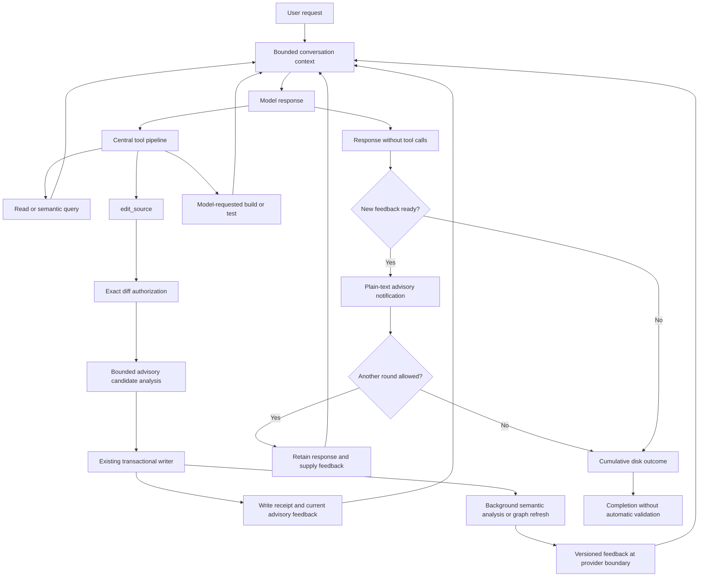

# Conversation and source editing

Threadsmith runs one ordinary model conversation. The model inspects relevant source, chooses an edit sequence, invokes advertised tools, and uses their results to continue the task. The host owns capability admission, trust, exact authorization, transactions, cancellation, durable effects and validation.

```mermaid
flowchart TD
    U[User request] --> C[Bounded conversation context]
    C --> M[Model response]
    M --> T[Central tool pipeline]
    T --> R[Read or semantic query]
    R --> C
    T --> E[edit_source]
    E --> A[Exact diff authorization]
    A --> S[Bounded advisory candidate analysis]
    S --> W[Existing transactional writer]
    W --> F[Write receipt and current advisory feedback]
    F --> C
    W --> B[Background semantic analysis or graph refresh]
    B --> P[Versioned feedback at provider boundary]
    P --> C
    M --> D[Response without tool calls]
    T --> V[Model-requested build or test]
    V --> C
    D --> Q{New feedback ready?}
    Q -->|Yes| N[Plain-text advisory notification]
    N --> L{Another round allowed?}
    L -->|Yes| H[Retain response and supply feedback]
    H --> C
    L -->|No| O[Cumulative disk outcome]
    Q -->|No| O
    O --> X[Completion without automatic validation]
```

`edit_source` accepts a rationale and an ordered list of create, replace, delete, move or supported semantic-rename operations. Host identities are assigned by the application. Supporting reads are independent of the write set. The existing scheduler preserves dependent tool order and the workspace edit lease serializes writes.

Enabled tools are advertised according to current trust and tool allow/deny policy, without phase, side-effect, or conversation opt-in filtering. Required approval is enforced at invocation. The tool pipeline retains policy, hooks, activity events, resource bounds and cancellation. The edit application captures current touched endpoints, resolves exact anchors, stages the diff and applies the surviving mutation approval policy. A declined edit returns a denied receipt; a changed source precondition returns a conflict requiring a fresh read. Neither outcome silently applies changes.

After authorization, the semantic owner analyzes the candidate within a bounded allowance. Compiler errors are advisory: well-formed authorized edits can temporarily introduce syntax or semantic errors. The effect journal persists exact before/after endpoint identities before invoking the existing writer. The writer rechecks preconditions and verifies final bytes. Disk outcome and semantic outcome remain separate.

Matching candidate results are reused after commit. Broader owner/dependent analysis continues through the existing compiler coordinator with generation fencing and bounded coverage. New diagnostics enter the ordinary conversation at a provider-compatible boundary; already delivered tool results are preserved. Graph replacement temporarily marks earlier applied analysis obsolete while retaining delivery tracking for its pending verified replacement. Missing or terminal obsolete analysis is reported explicitly. Model-facing receipts omit error totals while analysis is pending, obsolete, or has no completed project coverage; omitted totals are unknown, not zero.

If newer advisory evidence arrives while the model writes its final response, the host supplies it through the same feedback boundary and permits a follow-up response within the configured round and budget limits. The previous response remains in history so outdated validation claims can be corrected. User-visible advisory notifications contain a plain-text coverage and error summary; serialized analysis is reserved for model context, not the output window. The host does not wait for pending analysis or start a mandatory repair cycle. Model instructions require repairing errors introduced by its changes before finishing, preserving the requested behavior and repository rules, and inspecting updated feedback. If repair conflicts with the request, the model must explain the conflict and ask for direction; unrelated existing errors remain outside scope. If no newer evidence is available, the ordinary final response ends model continuation and records cumulative disk effects; it does not launch validation. The model decides when to invoke build and test tools, with guidance to resolve incremental compiler errors and obtain current feedback first. Advisory compiler feedback never establishes build or test success. Cancellation or a later provider failure preserves already proven disk effects in the durable outcome.

No executable plan, plan approval, step, tranche, proposal-generation turn or completion tool is required. A user-requested written plan is ordinary advisory conversation text.

See [mutation model](../architecture/mutation-model.md), [execution recovery](execution-resumption.md), [semantic refresh](semantic-refresh.md), and [validation pipeline](../architecture/validation-pipeline.md).
